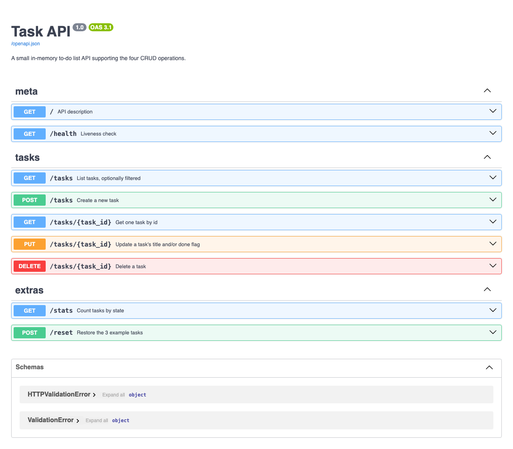
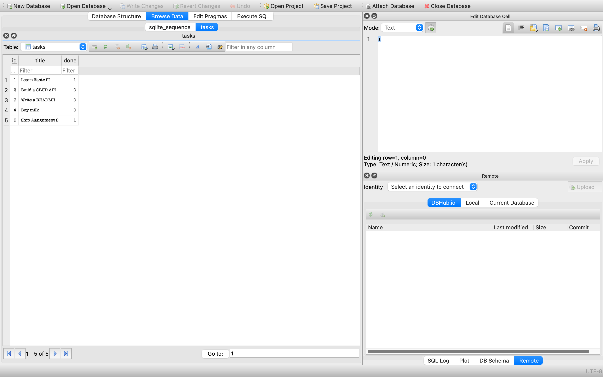

# Task API

A small REST API that manages a to-do list. It supports the four CRUD operations — **C**reate, **R**ead, **U**pdate, **D**elete — over a list of tasks, plus filtering, search and stats.

Built with [FastAPI](https://fastapi.tiangolo.com/), served by [Uvicorn](https://www.uvicorn.org/), and stored in [SQLite](https://www.sqlite.org/). The tasks live in a real database file, so **they survive a server restart** (see [Where the data lives](#where-the-data-lives)).

A task looks like this:

```json
{ "id": 1, "title": "Learn FastAPI", "done": true }
```

## Install & run

Requires Python 3.9 or newer. From the project root:

```bash
python3 -m venv .venv && .venv/bin/pip install -r requirements.txt && .venv/bin/uvicorn main:app --reload --port 8000
```

The server starts on <http://localhost:8000>. Interactive docs are at <http://localhost:8000/docs>.

Nothing else to set up. There is no database server to install, no connection string to
configure and no migration to run: on first start the application creates `tasks.db`,
creates the `tasks` table, and inserts the three example tasks. Clone the repo, run the
command above, and it works.

## Where the data lives

The database is a single file, **`tasks.db`**, in the project root — next to `main.py`.
Set the `TASKS_DB` environment variable to put it somewhere else.

That file is deliberately **not** committed (it is listed in `.gitignore`). A database is
generated state, not source code: committing it would mean every clone carried someone
else's tasks, and two people editing tasks would produce merge conflicts in a binary file.
The application recreates it on demand instead.

### Why SQLite?

- **It needs no server.** Postgres or MySQL would mean installing and running a separate
  database process before the API could start. SQLite is a file, and the driver is part of
  Python's standard library — `requirements.txt` did not gain a single new entry.
- **It is a real SQL database.** The same `SELECT`, `INSERT`, `UPDATE` and `DELETE`
  statements that work here work against a bigger database later, so nothing learned is
  wasted.
- **It suits the workload.** One process, one small table, low traffic. SQLite is a poor
  fit for many servers writing at once, which is exactly when you would reach for Postgres.

### Schema

```sql
CREATE TABLE IF NOT EXISTS tasks (
    id    INTEGER PRIMARY KEY AUTOINCREMENT,
    title TEXT    NOT NULL,
    done  INTEGER NOT NULL DEFAULT 0
);
```

SQLite has no boolean type, so `done` is stored as `1`/`0` and converted back to
`true`/`false` before the API returns JSON.

`AUTOINCREMENT` also fixed a bug carried over from Assignment 1. That version calculated
the next id with `max(ids) + 1`, which recycled an id whenever the highest-numbered task
was deleted. SQLite guarantees an id is never reused.

## Endpoints

| Method | Path | Description | Success | Errors |
| --- | --- | --- | --- | --- |
| `GET` | `/` | What this API is | `200` | — |
| `GET` | `/health` | Liveness check — returns `{"status":"ok"}` | `200` | — |
| `GET` | `/tasks` | List all tasks | `200` | — |
| `GET` | `/tasks?done=true` | List only finished tasks (`false` for unfinished) | `200` | `422` if not a boolean |
| `GET` | `/tasks?search=milk` | List tasks whose title contains the text (case-insensitive) | `200` | — |
| `GET` | `/tasks/{id}` | Get one task | `200` | `404` unknown id |
| `POST` | `/tasks` | Create a task from `{"title":"..."}` | `201` | `400` missing/empty title |
| `PUT` | `/tasks/{id}` | Update `title` and/or `done` | `200` | `400` empty/invalid body, `404` unknown id |
| `DELETE` | `/tasks/{id}` | Delete a task (empty body) | `204` | `404` unknown id |
| `GET` | `/stats` | Counts: `{"total":3,"done":1,"open":2}` | `200` | — |
| `POST` | `/reset` | Restore the 3 example tasks | `200` | — |

`done` and `search` can be combined: `GET /tasks?done=false&search=milk`.

Errors are always JSON in the shape `{"error": "..."}`.

## Example: create a task, then ask for one that doesn't exist

```console
$ curl -i -X POST http://localhost:8000/tasks -H "Content-Type: application/json" -d '{"title":"Buy milk"}'
HTTP/1.1 201 Created
date: Mon, 03 Aug 2026 23:50:48 GMT
server: uvicorn
content-length: 40
content-type: application/json

{"id":4,"title":"Buy milk","done":false}

$ curl -i http://localhost:8000/tasks/99
HTTP/1.1 404 Not Found
date: Mon, 03 Aug 2026 23:50:48 GMT
server: uvicorn
content-length: 29
content-type: application/json

{"error":"Task 99 not found"}
```

## Interactive docs

FastAPI generates an OpenAPI description of the code and Swagger UI renders it at
<http://localhost:8000/docs> — every endpoint listed, each with a **Try it out** button that
sends real requests from the browser.



## Running the whole stack with Docker

The API and a PostgreSQL database start together with one command:

```bash
cp .env.example .env      # then edit the password
docker compose up
```

That builds the app image, starts Postgres 16, waits for the database to report healthy,
runs `db/init.sql` to create the `tasks` table and seed it, and serves the API on
<http://localhost:8000>. The database is published on host port **5433**, chosen so it
does not collide with a PostgreSQL already running natively on 5432.

Postgres stores its files in a named volume, `postgres_data`. The volume is what makes
the data outlive the container: `docker compose down` removes the containers and the rows
survive, because the volume is untouched. Only `docker compose down -v` deletes it.

### Configuration

The connection string lives in `.env`, which is **gitignored and never committed**.
[`.env.example`](.env.example) is committed and documents every variable:

| Variable | Purpose |
| --- | --- |
| `POSTGRES_USER` / `POSTGRES_PASSWORD` / `POSTGRES_DB` | credentials the container is created with |
| `POSTGRES_PORT` | host port the database is published on (default `5433`) |
| `DATABASE_URL` | what the app connects with — `db:5432` inside compose, `localhost:5433` from your machine |

## Swapping the storage layer

Assignment 2 stored tasks in SQLite. This assignment swaps in PostgreSQL, and the point
of the exercise is how little had to move to do it:

```
main.py            routes        UNCHANGED
db.py              selector      picks a repository from DATABASE_URL
repositories/
  sqlite_repo.py   A2 storage    unchanged, still the fallback
  postgres_repo.py new storage   same function names, SQL dialect differs
```

**Honestly: `main.py` was not edited at all.** `git diff` reports zero changes to it
across this assignment — the routes still call `db.list_tasks(...)`, `db.create_task(...)`
and so on, exactly as before. `db.py` stopped being the SQLite implementation and became a
seven-line selector that imports one repository or the other:

```python
if os.environ.get("DATABASE_URL"):
    from repositories import postgres_repo as _repo
else:
    from repositories import sqlite_repo as _repo
```

With no `DATABASE_URL` the app still runs on SQLite with no database server at all, which
is why the A2 behaviour is still reachable. The two repositories are not identical inside —
Postgres has a real `BOOLEAN` where SQLite fakes one with `0`/`1`, uses `%s` placeholders
instead of `?`, `SERIAL` instead of `AUTOINCREMENT`, and `ILIKE` instead of lowercasing
both sides for case-insensitive search. None of that leaks upward, which is the whole
argument for the layering.

## Proving the data persists

Persistence was checked three ways, in increasing severity. Every transcript below is
real output from this machine.

**1. Restart the app container.** Two tasks created through the API, then the app is
restarted while the database keeps running:

```console
$ curl -s -X POST localhost:8000/tasks -H "Content-Type: application/json" -d '{"title":"survives app restart"}'
$ docker compose restart app
 Container flyrank-crud-api-app-1  Started

$ curl -s http://localhost:8000/tasks
[{"id":1,...},{"id":2,...},{"id":3,...},{"id":4,"title":"survives app restart","done":false},{"id":5,"title":"survives container restart","done":false}]
```

**2. Restart the database container as well.** Both containers bounce:

```console
$ docker compose restart db app
$ curl -s http://localhost:8000/tasks
[... all 5 tasks still present ...]

$ docker compose exec db psql -U tasks -d tasks -tAc "SELECT COUNT(*) FROM tasks;"
5
```

**3. Destroy the containers entirely.** `docker compose down` removes the containers and
the network — the volume is deliberately left alone:

```console
$ docker compose down
 Container flyrank-crud-api-db-1  Removed
 Network flyrank-crud-api_default  Removed

$ docker volume ls --filter name=flyrank-crud-api_postgres_data
flyrank-crud-api_postgres_data (local)     <- survives

$ docker compose up -d
$ curl -s http://localhost:8000/tasks
[... all 5 tasks still present ...]
```

**The control test.** To show it really is the volume doing this rather than something
incidental, the same teardown *with* `-v` deletes the volume, and the data does not come
back:

```console
$ docker compose down -v
 Volume flyrank-crud-api_postgres_data  Removed

$ docker compose up -d
$ curl -s http://localhost:8000/tasks
[{"id":1,"title":"Learn FastAPI","done":true},{"id":2,"title":"Build a CRUD API","done":false},{"id":3,"title":"Write a README","done":false}]
```

The two custom tasks are gone and only the seeds from `db/init.sql` remain. That is the
difference between a container and a volume in one command: containers are disposable,
the volume is where the data actually lives.

## Looking inside the database

Because the data is now a file rather than a variable, you can open it with tools that
know nothing about this project. [DB Browser for SQLite](https://sqlitebrowser.org/) is a
free graphical viewer:

```bash
brew install --cask db-browser-for-sqlite   # macOS
open -a "DB Browser for SQLite" tasks.db
```



The **Browse Data** tab above is the `tasks` table exactly as the API sees it. Note the
`done` column: `1` and `0`, not `true` and `false` — SQLite has no boolean type, so the
repository converts the integer back into a JSON boolean on the way out.

Or query it straight from the terminal, which ships with macOS and most Linux distributions:

```console
$ sqlite3 -header -column tasks.db "SELECT * FROM tasks;"
id  title              done
--  -----------------  ----
1   Learn FastAPI      1
2   Build a CRUD API   0
3   Write a README     0
4   Buy milk           0
5   Ship Assignment 2  0
```

Changes made here are visible through the API on the very next request — no restart
required. Marking everything complete in SQL:

```console
$ sqlite3 tasks.db "UPDATE tasks SET done = 1;"

$ curl -s http://localhost:8000/stats
{"total":5,"done":5,"open":0}
```

More queries, with their real output, are in
[`docs/sql-exploration.md`](docs/sql-exploration.md).

## The mortality experiment, and its cure

**Assignment 1 (in memory).** Create a couple of tasks, stop the server, start it again,
then `GET /tasks`: the tasks were gone and the list was back to the 3 examples — a request
for one of them returned `404`. The tasks lived in an ordinary Python list held in the
server process's memory, so the list was rebuilt from its seed values every time the
process started, and everything the previous process held was discarded when it exited.

**Assignment 2 (in SQLite).** The same experiment now ends differently:

```console
$ curl -s -X POST http://localhost:8000/tasks -H "Content-Type: application/json" -d '{"title":"Buy milk"}'
{"id":4,"title":"Buy milk","done":false}

# stop the server with Ctrl-C, then start it again

$ curl -s http://localhost:8000/tasks
[...,{"id":4,"title":"Buy milk","done":false}]
```

Nothing about the API changed — same URL, same method, same JSON. What changed is where
the data sits. The list was inside the process and died with it; the table is in a file on
disk that outlives any number of restarts. That is the whole point of a database, and it
is why the endpoint code barely moved: `GET /tasks` went from reading a Python list to
running `SELECT id, title, done FROM tasks`, and every client stayed unaware.

## AI vs me

I built Stages 0–6 by hand first, so I knew exactly what "correct" looked like before
letting an AI near it. The AI code is kept separate in [`ai-version/`](ai-version/) and
`main.py` was never touched by the experiment.

### The prompt I gave it

> Build me a small REST API in Python with FastAPI that manages a to-do list.
>
> It should store tasks in memory (no database). Each task has an id, a title, and a
> done flag. I want the four CRUD operations: list all tasks, get one task by its id,
> create a task, update a task, and delete a task. Creating a task should only need a
> title; the server assigns the id and sets done to false. Getting or changing a task
> that doesn't exist should return a 404 error, and creating a task without a title
> should be rejected. Give me Swagger docs at /docs so I can try the endpoints in the
> browser.
>
> Keep it in one file and keep it simple.

Then I fired my own Stage 4 checkpoint calls at what came back. **It failed 4 of 9.**

| Call | want | mine | round 1 |
| --- | --- | --- | --- |
| `POST /tasks {}` | 400 | 400 | **422** |
| `POST /tasks {"title":""}` | 400 | 400 | **201** |
| `PUT /tasks/1 {}` | 400 | 400 | **200** |
| every error body | `{"error":…}` | `{"error":…}` | **`{"detail":…}`** |

### 1. What did the AI do better?

**Pydantic models instead of hand-written type checks.** My `create_task` inspects the
body by hand — `if not isinstance(title, str) or not title.strip()`. The AI declared
`class TaskCreate(BaseModel): title: str` and let the framework enforce it. I can explain
why that is better: the model is *both* the validator and the documentation. Because the
type is declared, FastAPI puts a real request schema into `/openapi.json`, so Swagger UI
shows the expected body shape and pre-fills the example. My version passes
`Dict[str, Any]`, so Swagger shows an empty `{}` and the reader has to guess that `title`
is the field. The AI got validation and documentation from one declaration; I wrote them
separately and only got one of them.

It was also shorter — 78 lines against my 129 — because `HTTPException` and `response_model`
removed the error-formatting and serialising code I had written out longhand.

### 2. What did it get wrong or quietly ignore?

**It ignored the status codes I did say, and invented ones I didn't.** I asked for tasks
without a title to be "rejected"; it rejected them with **422**, because that is Pydantic's
default. A client written against my API would treat that as an unexpected error. Worse,
`{"title": ""}` was *accepted* with **201** — `title: str` is satisfied by an empty string,
so an empty-titled task went straight into the list. The strictness I got by hand was an
accident of writing the check myself.

**It broke my error envelope.** Every error came back as `{"detail": "Task 99 not found"}`.
Mine returns `{"error": …}` everywhere. Neither is more correct, but the AI silently picked
the framework default over the convention my API already used — and the prompt never
mentioned it.

**It shipped an id bug I did not have.** It generated ids with `len(tasks) + 1`. Delete a
task from the middle of the list and the counter goes *backwards*:

```console
$ curl -s -X DELETE http://localhost:8001/tasks/2

$ curl -s http://localhost:8001/tasks
[{"id":1,"title":"Learn FastAPI","done":false},{"id":3,"title":"Write a README","done":false}]

$ curl -s -X POST http://localhost:8001/tasks -H "Content-Type: application/json" -d '{"title":"first new"}'
{"id":3,"title":"first new","done":false}

$ curl -s http://localhost:8001/tasks
[{"id":1,"title":"Learn FastAPI","done":false},{"id":3,"title":"Write a README","done":false},{"id":3,"title":"first new","done":false}]
```

Two tasks now share id 3. `GET /tasks/3` returns whichever comes first and the other is
unreachable — it can never be fetched, updated, or deleted again.

**In fairness, my own version has a milder form of the same bug.** I used
`max(ids) + 1`, which cannot produce duplicates, but it does recycle: delete the
highest-numbered task and the next task created takes its id back. Finding the AI's bug
is what made me go and test my own.

### 3. What did my prompt forget to specify?

Reading it back, my prompt named the error *situations* but almost none of the actual
*codes*. It never said 201, never said 204, never said 400, and never described what an
error body should look like. Every one of the failures above sits precisely in that gap —
the AI did not disobey me, it filled in silence with defaults. It also silently decided
the id strategy, whether an empty string counts as a title, and whether `PUT` with an
empty body is a no-op or an error. Three real product decisions, none of them mine.

### The rematch

I rewrote the prompt as an explicit status-code table with six rules pinning down the
things round 1 had guessed at ([`prompt-v2.md`](ai-version/prompt-v2.md)), and regenerated.

**In one sentence: nothing about the model changed, only the specification — and round 2
went from 5/9 to 9/9 on the checkpoint, added a 27-test suite, and fixed the duplicate-id
bug by replacing `len(tasks) + 1` with a monotonic counter that never reuses an id.**

Round 2 also fixed the one flaw it inherited from *my* code: in my version
`GET /tasks/abc` returns FastAPI's `{"detail":[…]}` instead of my own `{"error":…}` shape,
so my API speaks two different error formats. Round 2 routes every error — including
framework validation errors — through one handler, so a client only ever parses one shape.

**The lesson:** the AI's output was exactly as good as my specification, and I could only
grade it because I had already built the thing myself. When it returned 422 instead of 400
I knew that was wrong; without Stages 0–6 behind me, I would have read that code, seen it
was clean and modern, and shipped it.
